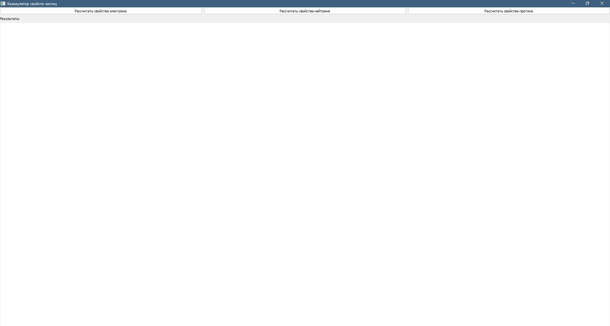

# Lab_12
**Сложность**: *Rare*
## Ход работы:
По своему варианту задания и GUI фреймворка создайте пакет, содержащий 3 модуля, и подключите его к основной программе. Основная программа должна предоставлять:

* графический пользовательский интерфейс с возможностями ввода требуемых параметров и отображения результатов расчёта,
* возможность сохранить результаты в отчёт формата .doc или .xls (например, пакеты python-docx и openpyxl).

## Условие задачи 
Элементарные частицы
* Электрон
* Нейтрон
* Протон

Расчёт удельного заряда, комптоновской длины волны.

## Скриншоты результатов

## Ссылки на используемые материалы
1. [Markdown Cheat Sheet](https://www.markdownguide.org/cheat-sheet/)
2. [Прог. Лабораторная работа №12](https://evil-teacher.on.fleek.co/prog_pm/term2/lab12/)
3. [Язык разметки Markdown: шпаргалка по синтаксису с примерами](https://skillbox.ru/media/code/yazyk-razmetki-markdown-shpargalka-po-sintaksisu-s-primerami/)